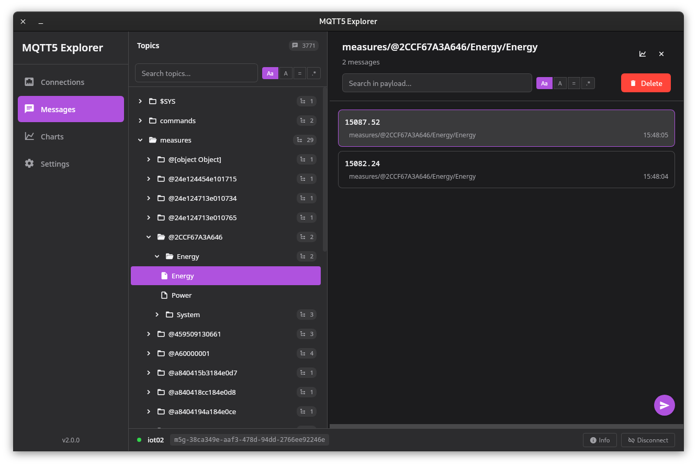
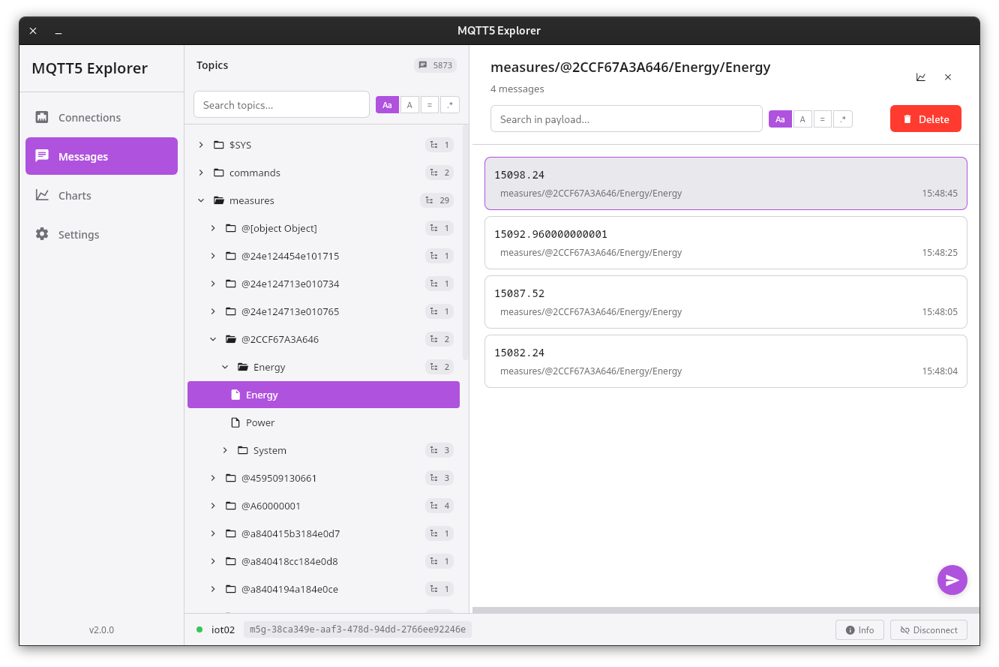

# MQTT5 Explorer (Go)

    

## About this project

The aim of this project is to bring the users a client app capable of making use of all the features of the version 5 of the MQTT protocol. The lack of any application that can offer the compatibility with the newer version of the protocol forced us to implement one to test the data of MQTT brokers workwise, why not to share this tool with others that may have the same issue?

## Screenshots

### Dark theme

### Light theme

## Project setup

You can configure the project by editing `wails.json`. More information about the project settings can be found here: [https://wails.io/docs/reference/project-config](https://wails.io/docs/reference/project-config)

### Live Development

To run in live development mode, run `wails dev` in the project directory. This will run a Vite development server that will provide very fast hot reload of your frontend changes. If you want to develop in a browser and have access to your Go methods, there is also a dev server that runs on [http://localhost:34115](http://localhost:34115). Connect to this in your browser, and you can call your Go code from devtools.

## Compiles for production

To build a redistributable, production mode package, use `wails build`.

## Get involved

See:

- [The code of conduct](CODE_OF_CONDUCT.md).
- [The contribution guidelines](.github/contributing.md).

## Contributors

